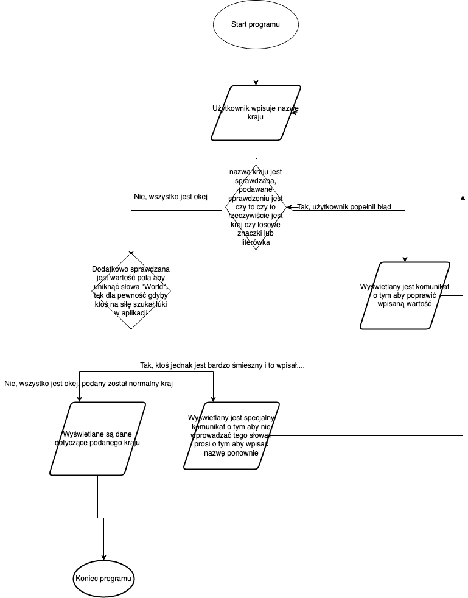

# CovidApp-Python

## Teb

* Aplikacja na zaliczenie przedmiotu ADIM

## Zadania Projektowe

* **Opis projektu**: 
    - Aplikacja polegajaca na pobieraniu z zewnetrznego API danych o wirusie COVID w danym kraju ktory podal end user. Aplikacja ma bardzo prosta strukture, pole tekstowe wraz z lejbelka mowiącą co trzeba wpisac, obok tego przycisk ktory po kliknieciu wykonuje zapytanie. Pod tym wszystkim pole w ktorym odpowiedz z API jest wyswietlana. Aplikacja takze umozliwia zapis danych do pliku.
    - **Schemat wyglądu okna aplikacji**: 
* **Opis problemow algorytmicznych**:
    - **API**: Największym problmem w aplikacji będzie znalezienie odpowiedniego API do pobrania wiadomości na temat statusu COVID-19 w podanym kraju.
    - **Walidacja formularza**: Drugim największym problemem w aplikacji jest sprawdzanie czy zostało wprowadzone poprawne państwo. W sytuacji gdy zostanie popełniona literówka musi zostać wyświetlony odpowiedni kominikat, jezeli zostanie wprowadzone słowo "WORLD" jest to dość głupie lecz mozliwe aby ktoś testując aplikacje takie coś wprowadzi, to takze zostanie poinformowany o tym aby nie wprowadzać takiego słowa.
    - **Error handling**: Poprawna obsługa błedów zawsze moze sprawiać problem, lecz jest to bardzo wazne aby powiadamiac o problemach w aplikacji, dlatego poprawna obsługa błędów jest bardzo wazna i trzeba to odpowiedni zakodować. 
* **Schemat blokowy programu**: 
* **UML Klass**: 